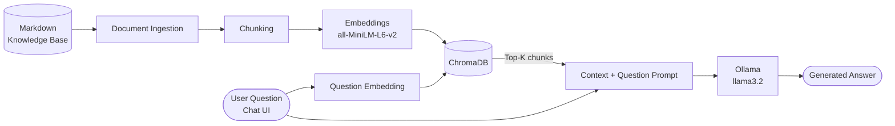

<div align="center">

# ☁️ CloudAlam RAG

**A local, evaluation-driven Retrieval-Augmented Generation system**
that answers questions from a curated knowledge base using ChromaDB, Sentence Transformers and Ollama.


</div>

---

## 📖 About

CloudAlam is a fictional cloud infrastructure provider. This project builds a complete RAG pipeline over its service and policy documentation (VPS hosting, managed databases, object storage, Kubernetes, backups, support and SLA targets) so that answers are grounded in company documents rather than in the language model's own knowledge.

It goes beyond a basic chatbot: the pipeline is **measured**, not just demonstrated. Retrieval quality and answer completeness are tested with dedicated evaluation scripts, and the known limitations of those tests are documented openly.

<!--
  📸 Add a screenshot or short GIF of chat_ui.py here, e.g.:
  <p align="center"></p>
-->

---

## ✨ Features

| | Feature | Details |
| --- | --- | --- |
| 📥 | **Document ingestion** | Loads Markdown knowledge-base documents |
| ✂️ | **Chunking** | Splits documents into focused, retrieval-sized passages |
| 🧠 | **Semantic embeddings** | `sentence-transformers/all-MiniLM-L6-v2` for both chunks and questions |
| 🗄️ | **Persistent vector store** | ChromaDB, reusable between runs |
| 🔎 | **Semantic search** | Retrieves the top matching chunks for each question |
| 🤖 | **Local generation** | `llama3.2` served by Ollama through its local API |
| 💬 | **Chat interface** | Interactive UI with lazy loading for faster startup |
| 📏 | **Retrieval evaluation** | Hit Rate@3 and MRR |
| ✅ | **Answer evaluation** | Required-fact checks on generated answers |

---

## 🏗️ Architecture



The ingestion pipeline prepares and indexes the knowledge base. At question time, the app retrieves the most relevant chunks and passes them to the local model as context.

---

## 🧰 Tech Stack

| Technology | Role |
| --- | --- |
| **Python** | Implementation language and pipeline orchestration |
| **ChromaDB** | Persistent vector storage and similarity search |
| **Sentence Transformers** | Embedding generation |
| **all-MiniLM-L6-v2** | Embedding model for semantic retrieval |
| **Ollama** | Runs the language model locally and exposes the generation API |
| **llama3.2** | Answer generation from retrieved context |
| **Markdown** | Source format of the knowledge base |

---

## 🚀 Quick Start

**Prerequisites:** Python 3, [Ollama](https://ollama.com) installed and running, and the Python packages used by the scripts (including `chromadb`, `sentence-transformers` and the UI framework used by `chat_ui.py`).

```bash
# 1. Make sure the model is available in Ollama
ollama pull llama3.2

# 2. Install dependencies
pip install -r requirements.txt   # if the file is present

# 3. Build the vector index (skip if chroma_db_fast/ already exists and matches your documents)
python load_documents.py
python chunk_documents.py
python embed_documents.py
python chroma_db.py

# 4. Launch the app
python chat_ui.py
```

> The app calls the Ollama generation API at `http://localhost:11434/api/generate`, so keep Ollama running while you use it.
>
> Check each script's implementation for its exact inputs and outputs before re-running the indexing steps.

To test retrieval on its own:

```bash
python search_chroma.py
```

---

## 📊 Evaluation

Quality is treated as a measurable property. Two scripts evaluate different parts of the pipeline.

| Evaluation | Script | Test set | Result |
| --- | --- | --- | --- |
| Retrieval — **Hit Rate@3** | `evaluate_rag.py` | 15 questions | **100%** (15/15) |
| Retrieval — **MRR** | `evaluate_rag.py` | 15 questions | **0.967** |
| Answers — **required facts** | `evaluate_answers.py` | 15 questions | **93.33%** (14/15) |

```bash
python evaluate_rag.py
python evaluate_answers.py
```

<details>
<summary><b>🔍 Details and interpretation</b></summary>

### Retrieval (`evaluate_rag.py`)
Evaluation uses the top three retrieved chunks/documents and checks whether the expected source is among them. One query, about the Standard Object Storage price, ranked its expected source second instead of first, which accounts for the MRR of 0.967.

### Answers (`evaluate_answers.py`)
The single failure came from exact substring matching: the expected text was `24/7`, while the model answered "24 hours a day, 7 days a week". The answer was semantically correct, so this exposed a limitation of the evaluator, not a factual error in the response. Exact matching can produce false negatives; a stronger evaluator should handle semantic equivalence and be validated against manually reviewed examples.

### Reading these numbers
These results reflect a small, curated test set. They should not be taken as a guarantee of performance on unseen questions or larger datasets. Results also depend on the knowledge base, vector index, model version, prompt and test set, so re-run the evaluations after changing any of them.

</details>

### 🎯 Next step: faithfulness & hallucination detection

Containing an expected fact is not the same as being supported by the retrieved context: an answer can include the right fact and still add unsupported claims. The planned evaluation checks whether each answer is backed by the passages retrieved for that question. LLM-as-a-judge scoring may help, but its decisions should be treated as estimates and reviewed against the source passages, especially in ambiguous cases. *This stage is not yet implemented.*

---

## 📚 Knowledge Base

**10 Markdown documents → 82 indexed chunks**, covering:

| Area | Example information |
| --- | --- |
| VPS hosting | Basic, Pro and Business plans, resource allocations, pricing |
| Backups | Optional VPS backups, six-hour intervals when enabled, seven daily recovery points |
| Managed databases | PostgreSQL, MySQL and Redis with Starter, Standard and Pro tiers |
| Object storage | S3-compatible storage, Standard / Infrequent pricing |
| Kubernetes | Frankfurt deployment across Zones 1 and 2 |
| Customer support | 24/7 support, target first-response times by severity |
| Service availability | Standard VPS target SLA of 99.9% |

All details are fictional and exist to demonstrate RAG over structured company documentation. The Markdown files are the source of truth; the `chroma_db_fast/` directory is generated locally and can be recreated.

---

## 🗂️ Project Structure

```text
CloudAlam/
├── load_documents.py     # Loads source knowledge-base documents
├── chunk_documents.py    # Splits documents into retrieval-sized chunks
├── embed_documents.py    # Creates embeddings for document chunks
├── chroma_db.py          # Sets up or manages the ChromaDB index
├── search_chroma.py      # Tests semantic retrieval against the vector store
├── rag.py                # RAG pipeline: retrieve context, generate an answer
├── chat_ui.py            # Interactive chat interface
├── evaluate_rag.py       # Retrieval evaluation (Hit Rate@3, MRR)
├── evaluate_answers.py   # Required-fact answer evaluation
├── chroma_db_fast/       # Persisted ChromaDB data (generated locally)
└── README.md
```

---

## ⚠️ Scope & Limitations

- The knowledge base is small, curated and fictional, so scores may not generalize to other domains or larger corpora.
- Retrieval metrics show whether relevant sources are retrieved, not whether the generated answer is correct.
- Required-fact evaluation relies on exact string matching and can miss semantic equivalents.
- Faithfulness evaluation is planned but not yet implemented.
- The project documents a local development workflow. Production deployment, authentication, monitoring and access control are out of scope.

---

## 🎓 What This Project Demonstrates

Building a RAG pipeline end to end, preparing documents for semantic search, reusing embeddings, querying vectors with ChromaDB, connecting a local LLM over HTTP, designing context-aware prompts, measuring retrieval with ranking metrics, understanding the limits of exact-match answer evaluation, and planning faithfulness evaluation.

---

<!--
## 📄 License
Add your license here.

## 👤 Author

**Romina Valinejad**

- GitHub: [@rominavalinejad](https://github.com/rominavalinejad)
- LinkedIn: [rominavalinejad](https://www.linkedin.com/in/romina-valinejad-b40381413)

## 📄 License

This project is licensed under the MIT License. See the [LICENSE](LICENSE) file for details.
